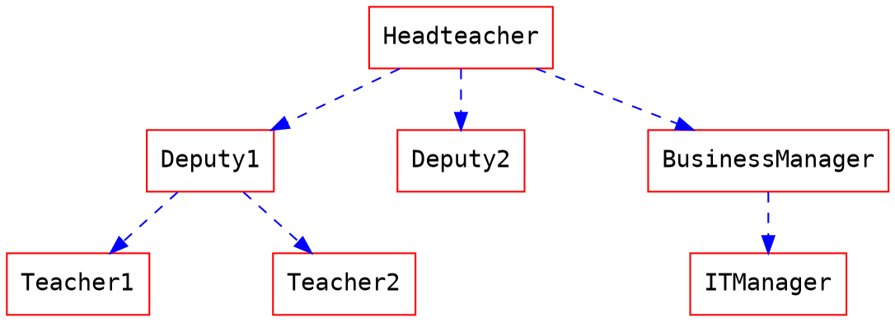

# Input network data

A C function to read a simple road network data 

# Road Network

* Each node id are integer
* 

# Input Data format

* file name : `network.dat`

|from node id|to node id|free flow travel time|capacity|
|---|---|---|---|
|1  |2  |10 |500|
|1  |3  |13 |300|
|2  |3  |12 |100|
|2  |4  |15 |200|
|3  |4  |17 |600|

# Usage

#

